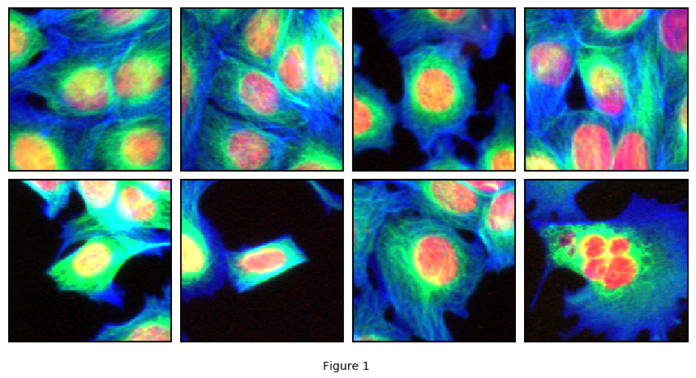
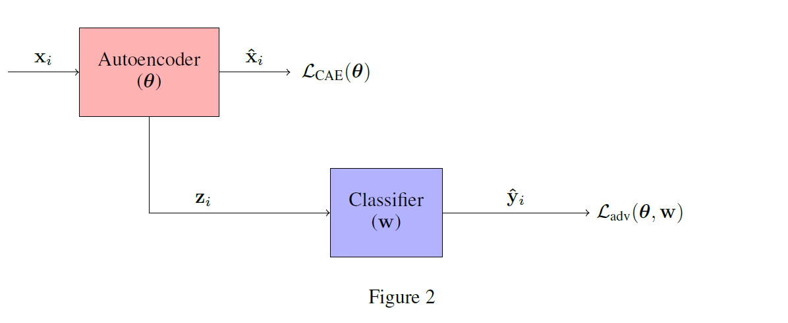
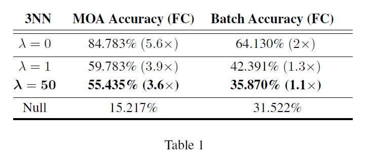

# Adjusting for Confounding in Unsupervised Latent Representations of Images

This repository collects implementation details for the analyses reported in the paper [Adjusting for Confounding in Unsupervised Latent Representations of Images.](https://arxiv.org/abs/1811.06498)

If you find our analyses helpful for your project, please consider citing our publication:

# Contents

- [Dependencies](#dependencies)
- [Data](#data)
- [Background and Motivations](#background-and-motivations)
- [Training](#training)
- [Results](#results)
- [Models](#models)
- [References](#references)

# Dependencies

`python 3.5.2`
`skimage 0.13.1`

`numpy 1.14.3`
`torch 0.4.0`
`torchvision 0.2.1`

# Data 

We used the BBBC021v1 image set, which is a resource freely available to download through the Broad bioimage benchmark collection web server ([https://data.broadinstitute.org/bbbc/](https://data.broadinstitute.org/bbbc/)). These data capture phenotype changes of cancer cell lines exposed to a compendium of drugs. The imaging set was annotated as benchmark data to develop phenotypic profiling methods and, in particular, to validate their ability to predict the molecular mechanism of action (MOA) for a collection of compounds. Phenotypes were captured, across 10 weeks (batches), by labelling cells with DAPI, Tubulin, and Actin, thereby generating a triplet of single channel images (one per fluorescent marker) for each treatment.

For each image in the BBBC021v1 set, we detected cell nuclei using the algorithm difference of Gaussians on the DAPI channel. We cropped patches of 128 X 128 pixels centred around each nucleus, and annotated 128 X 128 X 3 images by concatenating patches from the DAPI, Tubulin, and Actin channels. Representative training images are displayed in Figure 1.

# Background and Motivations

Previous works using BBBC021v1 data have shown it’s possible to learn deep representations capturing biological (MOA) knowledge [[1,2,3]](#references). One study has shown the presence of a strong confounder, as BBBC021v1 representations also encode spurious knowledge capable of discriminating treatments according to their imaging batch [[2]](#references).  However, no detailed analyses have been undertaken to asses the impact of such bias, in particular whether it’s feasible to remove nuisance knowledge encoded in learned embeddings.

In our work, we showed how it’s possible to learn unbiased representations encoding biological (MOA) knowledge and invariant to the batch effect confounder.

# Training

Our model's architecture is comprised of two agents, a convolutional autoencoder (CAE) to learn unsupervised representations, and an adversarial classifier to enforce CAE codes to be invariant to the batch effect confounder (Figure 2).

The learning happens in two steps:

- **Pretraining phase**

- **Adversarial phase**

**1. Pretraining phase.** We annotated a data set by uniformly sampling images across batches, _i.e._ we collected a training sample comprised of 74 635 examples per imaging batch. First of all, we used such data set for training the autoencoder to learn compressed representations of microscopy images (all details can be found in the script ``PretrainCAE.py`` in the folder ``./scripts``). Subsequently, using CAE codes as inputs, we trained the adversarial classifier to discriminate batches (see ``PretrainNeuralNetwork.py`` in the folder ``./scripts``).

**2. Adversarial phase.** This phase is comprised of 2 steps:

(A) First we solved:

Crucially, in this step we only updated the CAE weights, and kept the classifier frozen. With this step, we minimised the autoencoder’s reconstruction loss whilst ensuring the CAE codes are uninformative for the batch effect confounder. 0" title="\large \lambda>0" /> is an hyperparameter to tune, and higher values result in less biased latent representations.

(B) Then we solved:

In this step we only updated the classifier’s weights. Steps (A) and (B) were repeated until equilibrium where both losses reached a plateau [[4]](#references). See ``AdversarialTraining.py`` in the folder ``./scripts`` for all implementation details.

# Results

To assess whether we learned unsupervised representations viod of nuisance (batch effect) knowledge but biologically meaningful, we used CAE codes to predict batch and MOA labels. 

The results of our experiments are collected in Table 1. The first line () refers to the results before adversarial training, and shows how our deep representations capture phenotypic as well as spurious knowledge. However, as can be seen from the last line, using  allowed us to learn cellular embeddings which are uninformative for the batch effect confounder whilst still biologically meaningful.

Please refer to our publication for further details.  

# Models

Our CAE weights, before (``BroadCAE.pth``) and after (``FairBroadCAE.pth``) adversarial training, are freely available to download using the following links:

| CAE Weights | Size |
| --- | --- |
| [BroadCAE.pth](https://drive.google.com/file/d/1y2lifE13BlNXXiQs-47UtSlu_Cbe2ied/view?usp=sharing) | 131 MB |
| [FairBroadCAE.pth](https://drive.google.com/file/d/1plWByTaKo3YaCKKXNAhwLg7f5Id0nl8f/view?usp=sharing) | 131 MB |

# References

[1] Nick Pawlowski et al., [“Automating morphological profiling with generic deep convolutional
networks”,](https://www.biorxiv.org/content/early/2016/11/02/085118) bioRxiv 2016.

[2] D. Michael Ando et al., [“Improving Phenotypic Measurements in
High-Content Imaging Screens”,](https://www.biorxiv.org/content/early/2017/07/10/161422) bioRxiv 2017.

[3] Alexander Kensert et al., [“Transfer learning with deep convolutional neural network for classifying cellular morphological changes”,](https://www.biorxiv.org/content/early/2018/06/14/345728) bioRxiv 2018.

[4] Gilles Louppe et al., [Learning to Pivot with Adversarial Networks](https://arxiv.org/abs/1611.01046), NIPS 2017.

